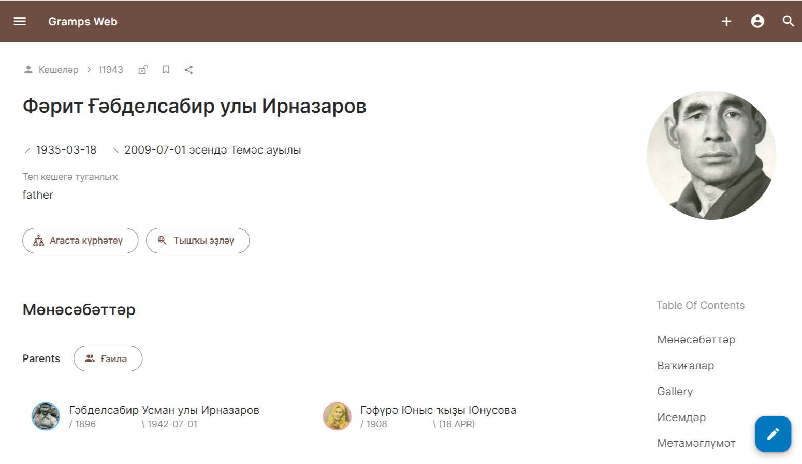

# Gramps Web Neutral Symbols Fork

This repository is a focused fork of the [Gramps Web frontend](https://github.com/gramps-project/gramps-web).

It exists for users who want a more religion-neutral visual style in genealogical data display, especially for birth and death markers. In many family trees, people of different faiths may appear in the same family line: Muslims, Christians, Jews, Buddhists, secular relatives, and others. This fork uses neutral symbols so the interface can feel welcoming to all of them without changing the underlying data model.

## Purpose of This Fork

The main goal of this fork is simple:

- keep Gramps Web familiar and lightweight;
- replace faith-associated birth/death symbols with neutral alternatives;
- avoid intrusive or heavy feature divergence from upstream;
- preserve compatibility with normal Gramps Web workflows.

This is not a criticism of the upstream project. It is an alternative presentation choice for users who prefer a neutral interface for multi-faith or interfaith family histories.

## Current Symbol Policy

This fork currently uses:

- birth: `/`
- death: `\`

The change is intentionally small, frontend-only, and easy to maintain.

More details are documented in [CHANGES_SYMBOLS.md](./CHANGES_SYMBOLS.md).

## Scope

This fork is intentionally narrow in scope. It is not trying to redesign Gramps Web or replace upstream direction.

Current focus:

- neutral genealogical symbols;
- minimal frontend-only customization;
- practical maintainability;
- respectful presentation for diverse families.

## Relationship to Upstream

This repository remains based on the Gramps Web frontend and fully acknowledges the work of the upstream project and its contributors.

- Upstream frontend: [gramps-project/gramps-web](https://github.com/gramps-project/gramps-web)
- Upstream backend: [gramps-project/gramps-web-api](https://github.com/gramps-project/gramps-web-api)
- Gramps project: [gramps-project.org](https://gramps-project.org)

This fork is maintained as a fork-specific customization. It is not currently intended for merge into upstream.

## Screenshot

The screenshot below shows the fork in use with neutral birth and death markers in a real person and family context.



## Running This Fork Locally

This fork includes a local Docker build setup so the modified frontend can be tested directly from this repository.

From the repository root:

```powershell
docker compose down
docker compose up --build -d
```

This builds the frontend from local source code and runs it with the Gramps Web API image.

## Development Notes

The repository includes:

- a local `docker-compose.yml` for building and testing the fork;
- a multi-stage `Dockerfile` that builds the frontend before packaging it;
- a centralized symbol definition so future UI components can stay consistent.

## Language Policy

The primary documentation language of this fork is English.

Planned additional languages for documentation and project notes:

- Russian
- Bashkir

## Contributing

Contributions are welcome when they align with the purpose of this fork.

Please read [CONTRIBUTING.md](./CONTRIBUTING.md) before opening issues or submitting changes.

## Credits

This fork would not exist without the upstream Gramps Web project and the broader Gramps community. Full credit for the original application design and functionality belongs to its maintainers and contributors.
